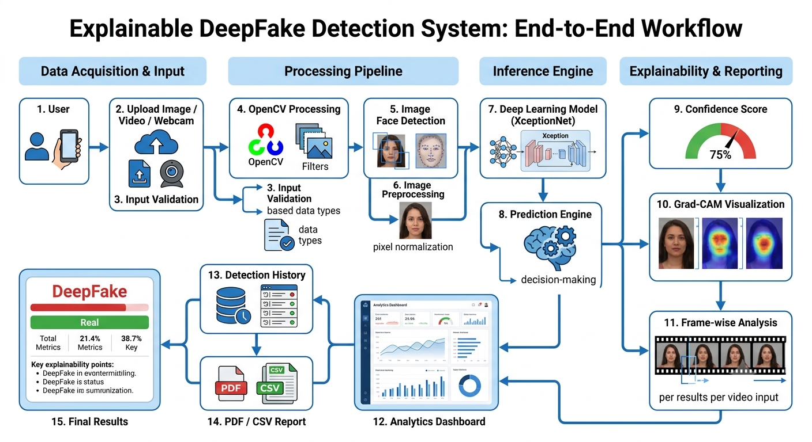
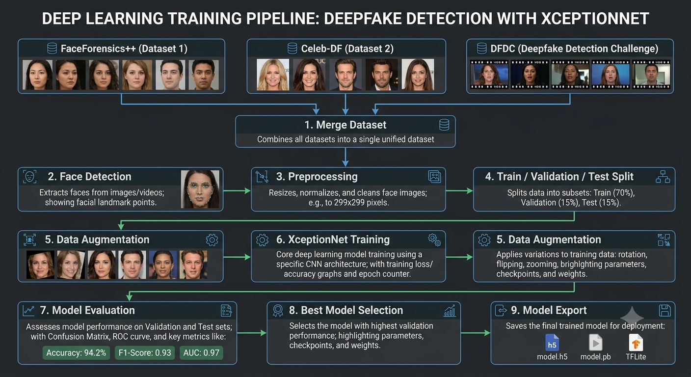
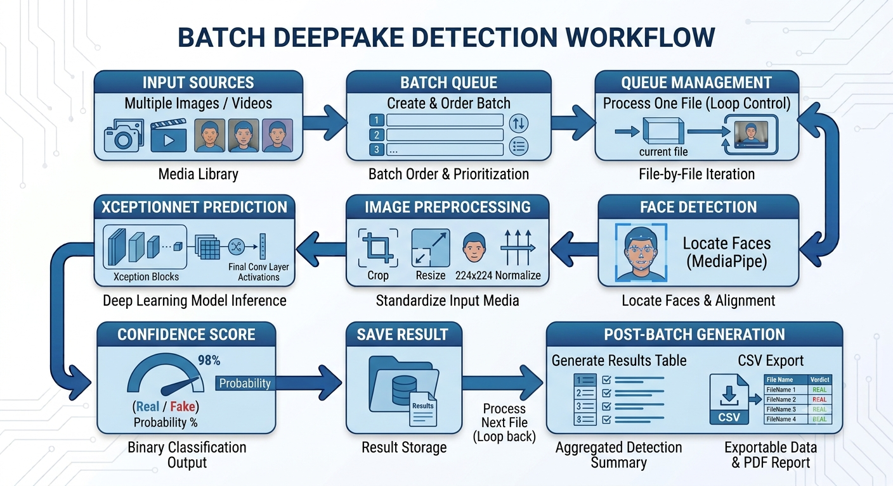
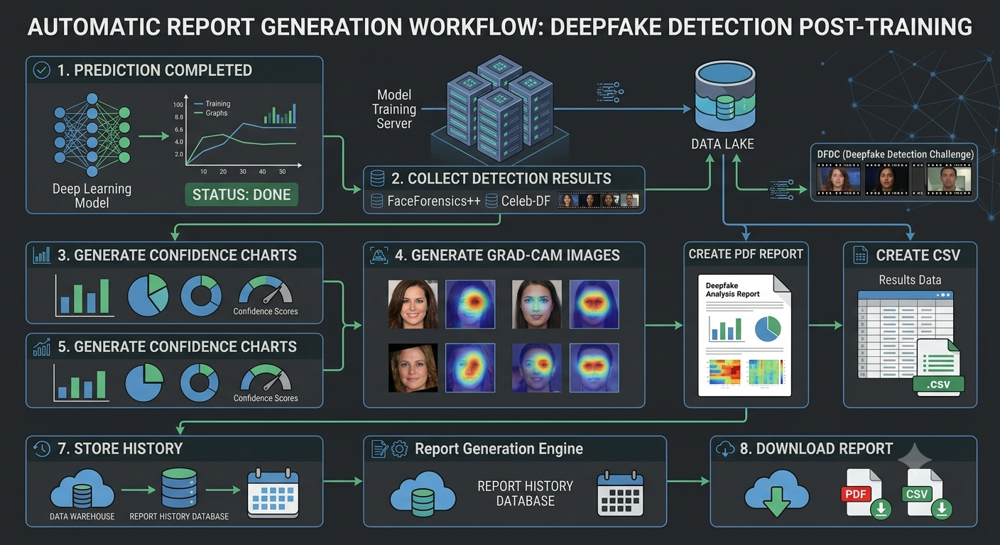
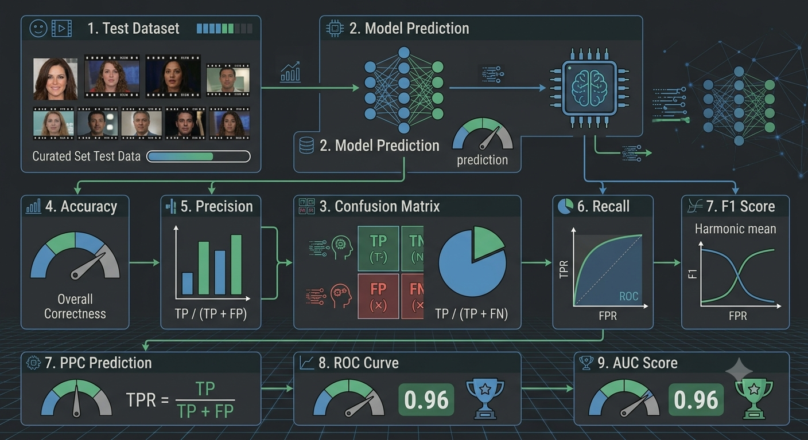

<div align="center">

# DeepFake Detection System
### Using XceptionNet · Grad-CAM · Frame-wise Video Analysis

*A production-grade AI system for detecting manipulated media with visual explainability*

<br/>

[](https://python.org)
[](https://tensorflow.org)
[](https://keras.io)
[](https://streamlit.io)
[](https://opencv.org)
[](https://mediapipe.dev)
[](LICENSE)
[]()
[]()

</div>

---

## Table of Contents

- [Project Overview](#-project-overview)
- [Features](#-features)
- [System Workflows](#-system-workflows)
  - [End-to-End System Workflow](#1️-end-to-end-system-workflow)
  - [Training Pipeline](#2️-training-pipeline)
  - [Batch Detection Workflow](#3️-batch-detection-workflow)
  - [Report Generation Workflow](#4️-report-generation-workflow)
  - [Performance Evaluation Pipeline](#5️-performance-evaluation-pipeline)
- [Tech Stack](#️-tech-stack)
- [Project Structure](#-project-structure)
- [Installation Guide](#-installation-guide)
- [Datasets](#-datasets)
- [Model Details](#-model-details)
- [Dashboard Preview](#-dashboard-preview)
- [Performance Metrics](#-performance-metrics)
- [Future Enhancements](#-future-enhancements)
- [License](#-license)
- [Author](#-author)
- [Acknowledgements](#-acknowledgements)

---

## Project Overview

### What is a DeepFake?

**DeepFake** refers to synthetic media — images, videos, or audio — in which a person's likeness is algorithmically swapped, altered, or fabricated using deep learning techniques such as **Generative Adversarial Networks (GANs)**, **autoencoders**, and **diffusion models**. Modern DeepFakes can produce hyper-realistic manipulations that are indistinguishable to the naked eye, posing serious threats to:

- **Identity theft and fraud**
- **Political misinformation and propaganda**
- **Fake news and media manipulation**
- **Legal evidence tampering**
- **Non-consensual synthetic media (NCSM)**

### Why is DeepFake Detection Critical?

As generative AI advances exponentially, the volume and sophistication of synthetic media has outpaced human ability to detect it. Automated detection systems powered by deep learning are now essential infrastructure for social media platforms, governments, law enforcement, journalists, and organizations protecting public trust.

### Why Explainable AI — Grad-CAM?

Black-box AI models, while powerful, produce predictions without justification — critically limiting trust in high-stakes scenarios. This project integrates **Gradient-weighted Class Activation Mapping (Grad-CAM)** to generate visual heatmaps that highlight *exactly which facial regions* triggered the model's decision. This transforms the system from a binary classifier into a **transparent, auditable, and explainable AI tool**.

### Project Objectives

| # | Objective |
|---|-----------|
| 1 | Build a production-grade DeepFake detection system using Transfer Learning on XceptionNet |
| 2 | Implement Grad-CAM visual explainability for all model predictions |
| 3 | Support image, video (frame-wise), webcam live, and batch detection pipelines |
| 4 | Provide a modern, interactive AI dashboard built with Streamlit |
| 5 | Generate automated PDF/CSV detection reports with evidence and Grad-CAM |
| 6 | Maintain a complete detection history with SQLite persistence |
| 7 | Enforce mathematically consistent confidence scores across all detection modes |

### Real-World Applications

| Domain | Application |
|--------|-------------|
| KYC Verification | Banks and fintech companies verifying customer identity |
| Media Integrity | News agencies authenticating video content before publishing |
| Digital Forensics | Legal investigation of potentially manipulated evidence |
| Social Platforms | Automated content moderation at scale |
| Academic Research | Benchmark evaluation of detection methods |

<p align="right"><a href="#-table-of-contents">↑ Back to Top</a></p>

---

## Features

| # | Feature | Description |
|---|---------|-------------|
| | **Image DeepFake Detection** | Upload any image; face is automatically extracted, preprocessed, and classified |
| | **Video DeepFake Detection** | Full video analysis with frame-by-frame inference and temporal aggregation |
| | **Frame-wise Video Analysis** | Per-frame confidence timeline with visual frame gallery |
| | **Explainable AI — Grad-CAM** | Heatmap overlay highlighting the specific facial regions that triggered detection |
| | **Confidence Score** | Mathematically consistent real/fake probability with confidence percentage |
| | **Confidence Visualization** | Interactive gauge chart and probability bar charts via Plotly |
| | **Webcam Detection** | Live real-time detection with auto-discovery of available camera indices |
| | **Batch Detection** | Multi-file queue processing with progress tracking and summary export |
| | **Detection History** | SQLite-backed history with search, filter, and export capabilities |
| | **PDF Report Generation** | Automated professional PDF reports with Grad-CAM and metadata |
| | **CSV Export** | Export batch or history results as structured CSV |
| | **Modern Streamlit Dashboard** | SaaS-grade UI with glassmorphism, dark/light theme, and micro-animations |
| | **Analytics Dashboard** | Session statistics, detection trends, and KPI cards |
| | **Settings & Configuration** | Threshold, confidence, and UI preferences |
| | **Responsive UI** | Adaptive layout optimized for different screen sizes |

<p align="right"><a href="#-table-of-contents">↑ Back to Top</a></p>

---

## System Workflows

This section documents every major pipeline in the system using architectural diagrams created for this project.

---

### 1️ End-to-End System Workflow

<p align="center">
  
</p>

**Overview:** The complete end-to-end flow from raw user input to final prediction and reporting. The pipeline begins with user input (image, video, webcam, or batch upload) which is validated and passed through OpenCV preprocessing. MediaPipe detects and extracts the face region, which is resized and normalized before being fed to the XceptionNet inference engine. The model simultaneously produces a prediction score and activates the Grad-CAM engine to generate a visual heatmap. Results are rendered on the Analytics Dashboard, persisted to the SQLite history database, and made available as a downloadable PDF/CSV report.

---

### 2️ Training Pipeline

<p align="center">
  
</p>

**Overview:** The XceptionNet model is trained on a merged dataset drawn from three industry-standard benchmarks: **FaceForensics++**, **Celeb-DF**, and **DFDC**. The pipeline begins with face detection and extraction across all video frames, followed by normalization and a 70/15/15 train/validation/test split. Data augmentation (rotation, flipping, zoom) is applied to the training set to improve generalization. XceptionNet is then trained using a **progressive unfreezing** strategy — the backbone is initially frozen for fast convergence, then partially unfrozen for fine-tuning. The best checkpoint is selected based on validation AUC and exported in `.h5`, `.pb`, and TFLite formats.

---

### 3️ Batch Detection Workflow

<p align="center">
  
</p>

**Overview:** The batch processing pipeline accepts multiple image and video files simultaneously, creating a prioritized processing queue. Each file is processed one-by-one through the standard pipeline: face detection via MediaPipe → image preprocessing (crop, resize to 224×224, normalize) → XceptionNet inference → confidence score output. Results are accumulated into an aggregated detection table displayed in the dashboard. Upon completion, the full batch summary is available as a downloadable CSV export and as a comprehensive PDF detection report.

---

### 4️ Report Generation Workflow

<p align="center">
  
</p>

**Overview:** After each detection or batch run, the report generation engine compiles a professional PDF document. The workflow collects completed detection results from the SQLite history database, generates confidence charts (bar, donut, gauge), attaches Grad-CAM heatmap images as visual evidence, and formats everything using ReportLab into a structured report. The report and accompanying CSV are stored with their paths logged in the database, making them accessible via the Reports page for download at any time. This provides a full audit trail from detection to documented evidence.

---

### 5️ Performance Evaluation Pipeline

<p align="center">
  
</p>

**Overview:** The model evaluation pipeline runs against the held-out test set that was never seen during training. Predictions are collected from XceptionNet and passed through the metrics engine which computes: **Accuracy** (overall correctness), **Precision** (TP / TP+FP), **Recall** (TP / TP+FN), **F1 Score** (harmonic mean), **Confusion Matrix** (TP/FP/TN/FN breakdown), **ROC Curve** and **AUC Score**. The evaluation system also supports **PPC (Probability-Calibrated Prediction)** analysis to ensure confidence scores are well-calibrated against actual outcomes.

<p align="right"><a href="#-table-of-contents">↑ Back to Top</a></p>

---

## Tech Stack

| Layer | Technology | Version | Purpose |
|-------|-----------|---------|---------|
| **Language** | Python | 3.11.x | Core development language |
| **Frontend** | Streamlit | 1.35.0 | Interactive web dashboard |
| **Deep Learning** | TensorFlow | 2.15.1 | Model training & inference |
| **Neural Network API** | Keras | 2.15.0 | High-level model construction |
| **Computer Vision** | OpenCV | 4.9.0.80 | Frame extraction, webcam, image ops |
| **Face Detection** | MediaPipe | 0.10.14 | Real-time face landmark detection |
| **Model Architecture** | XceptionNet | — | Transfer learning backbone (ImageNet) |
| **Explainability** | Grad-CAM | — | Visual explanation heatmaps |
| **Visualization** | Plotly | 5.22.0 | Interactive charts and gauges |
| **Visualization** | Matplotlib | 3.8.4 | Heatmap and static plot rendering |
| **Visualization** | Seaborn | 0.13.2 | Statistical plotting |
| **Data Processing** | NumPy | 1.26.4 | Array and matrix operations |
| **Data Processing** | Pandas | 2.2.2 | Tabular data handling |
| **ML Utilities** | Scikit-learn | 1.4.2 | Metrics, calibration, splitting |
| **Image Processing** | Pillow | 10.3.0 | Image I/O and manipulation |
| **Augmentation** | Albumentations | 1.4.7 | Training data augmentation |
| **PDF Reports** | ReportLab | 4.2.0 | Professional PDF generation |
| **Database** | SQLite3 | stdlib | Detection history persistence |
| **Configuration** | PyYAML | 6.0.1 | Config file management |
| **Environment** | python-dotenv | 1.0.1 | Environment variable management |
| **Progress** | tqdm | 4.66.4 | CLI progress bars |
| **Dataset Access** | Kaggle API | 1.6.12 | Dataset downloading |

<p align="right"><a href="#-table-of-contents">↑ Back to Top</a></p>

---

## Project Structure

```
DFDC/
└── deepfake_detection/
    │
    ├── 📄 app.py                        # Main Streamlit application entry point
    ├── 📄 train.py                      # Model training entry point
    ├── 📄 requirements.txt              # Python dependencies (pinned)
    ├── 📄 run.bat                       # Windows quick-launch script
    ├── 📄 README.md                     # Project documentation
    │
    ├── 📁 dashboard/                    # Streamlit UI layer
    │   ├── 📁 pages/                    # Individual dashboard pages
    │   │   ├── home.py                  # Landing page with KPI overview
    │   │   ├── image_detection.py       # Image upload & detection
    │   │   ├── video_detection.py       # Video upload & frame analysis
    │   │   ├── webcam_detection.py      # Live webcam detection
    │   │   ├── batch_detection.py       # Multi-file batch processing
    │   │   ├── reports.py               # PDF/CSV report generation
    │   │   ├── history.py               # Detection history & search
    │   │   ├── analytics.py             # Analytics dashboard
    │   │   ├── settings.py              # App configuration
    │   │   └── about.py                 # Project information
    │   ├── 📁 components/               # Reusable UI components
    │   │   ├── kpi_cards.py             # Animated KPI metric cards
    │   │   ├── charts.py                # Plotly chart components
    │   │   ├── gradcam_viewer.py        # Grad-CAM heatmap viewer
    │   │   ├── loader.py                # Animated loading components
    │   │   └── sidebar.py               # Navigation sidebar
    │   └── 📁 static/
    │       └── style.css                # Global CSS (glassmorphism + dark theme)
    │
    ├── 📁 inference/                    # Core detection engine
    │   ├── image_detector.py            # Image detection pipeline
    │   └── video_detector.py            # Video detection pipeline
    │
    ├── 📁 models/                       # Model architecture definitions
    │   ├── xceptionnet.py               # XceptionNet architecture
    │   ├── efficientnet.py              # EfficientNet (alternative backbone)
    │   ├── resnet50.py                  # ResNet50 (alternative backbone)
    │   └── model_factory.py             # Model loading & factory
    │
    ├── 📁 gradcam/                      # Explainability module
    │   └── grad_cam.py                  # Grad-CAM implementation
    │
    ├── 📁 preprocessing/                # Data preprocessing pipeline
    │   ├── face_extractor.py            # Face detection & extraction
    │   ├── pipeline.py                  # Full preprocessing pipeline
    │   ├── augmentor.py                 # Data augmentation
    │   └── dataset_validator.py         # Dataset integrity validation
    │
    ├── 📁 training/                     # Model training modules
    │   ├── trainer.py                   # Standard training loop
    │   ├── progressive_trainer.py       # Progressive unfreezing trainer
    │   └── data_loader.py               # TensorFlow Dataset loading
    │
    ├── 📁 evaluation/                   # Model evaluation
    │   ├── evaluator.py                 # Evaluation orchestrator
    │   └── metrics.py                   # Accuracy, F1, AUC, ROC metrics
    │
    ├── 📁 webcam/                       # Real-time webcam detection
    │   └── webcam_detector.py           # OpenCV webcam capture & inference
    │
    ├── 📁 reports/                      # Report generation
    │   └── pdf_generator.py             # ReportLab PDF compiler
    │
    ├── 📁 database/                     # Data persistence layer
    │   ├── schema.py                    # SQLite schema definition
    │   └── repository.py                # CRUD operations & queries
    │
    ├── 📁 assets/                       # Static assets
    │   ├── 📁 workflows/                # Architecture & workflow diagrams
    │   │   ├── system_workflow.png
    │   │   ├── training_pipeline.png
    │   │   ├── batch_workflow.png
    │   │   ├── report_workflow.png
    │   │   └── metrics_pipeline.png
    │   └── 📁 screenshots/              # Application screenshots
    │       ├── home.png
    │       ├── image_detection.png
    │       ├── video_detection.png
    │       ├── webcam.png
    │       ├── batch_detection.png
    │       ├── reports.png
    │       ├── history.png
    │       └── analytics.png
    │
    ├── 📁 configs/                      # YAML configuration files
    ├── 📁 data/                         # Raw & processed datasets
    ├── 📁 outputs/                      # Model checkpoints & exports
    ├── 📁 logs/                         # Training & application logs
    ├── 📁 scripts/                      # Utility & test scripts
    └── 📁 tests/                        # Unit & integration tests
```

<p align="right"><a href="#-table-of-contents">↑ Back to Top</a></p>

---

## Installation Guide

### Prerequisites

- **Python 3.11.x** — `python --version` to verify
- **pip 23+** — `pip --version` to verify
- Webcam *(optional — for live detection only)*
- GPU with CUDA *(optional — CPU inference fully supported)*

---

### Step 1 — Clone the Repository

```bash
git clone https://github.com/<your-username>/deepfake-detection.git
cd deepfake-detection/deepfake_detection
```

---

### Step 2 — Create a Virtual Environment

**Windows (PowerShell):**
```powershell
python -m venv venv
.\venv\Scripts\Activate.ps1
```

**macOS / Linux:**
```bash
python3 -m venv venv
source venv/bin/activate
```

---

### Step 3 — Install Dependencies

```bash
pip install --upgrade pip
pip install -r requirements.txt
```

> **Note:** All dependencies are version-pinned in `requirements.txt` for full reproducibility. TensorFlow 2.15.1 runs on CPU by default. GPU support requires a compatible CUDA 11.8+ installation.

---

### Step 4 — Run the Application

**Windows quick launch:**
```powershell
.\run.bat
```

**Manual launch:**
```bash
streamlit run app.py
```

The dashboard opens automatically at **http://localhost:8501**

---

### Step 5 — (Optional) Train the Model

```bash
python train.py
```

> Configure training parameters in `configs/` before running. Pre-trained weights should be placed in `outputs/` — they will be auto-discovered by the model factory.

<p align="right"><a href="#-table-of-contents">↑ Back to Top</a></p>

---

## Datasets

This project was designed and evaluated against the three most widely-used DeepFake datasets in academic research:

| Dataset | Publisher | Scale | Manipulation Types | Access |
|---------|-----------|-------|--------------------|--------|
| **FaceForensics++** | TU Munich | ~1.5M frames | Face swap, reenactment, neural textures | [Request Access](https://github.com/ondyari/FaceForensics) |
| **Celeb-DF** | Stevens Institute | ~590K frames | High-quality celebrity face swaps | [GitHub](https://github.com/yuezunli/celeb-deepfakeforensics) |
| **DFDC** | Meta AI | ~119K videos | Multi-modal, diverse demographics | [Kaggle](https://www.kaggle.com/c/deepfake-detection-challenge) |

**Why these three?**
- **FaceForensics++** is the gold-standard benchmark with multiple forgery methods at varying compression levels, enabling controlled evaluation across manipulation types.
- **Celeb-DF** contains high visual-fidelity fakes that challenge detectors trained on lower-quality data, testing generalization to better forgeries.
- **DFDC** is the largest and most demographically diverse dataset, created by Meta specifically to stress-test detection systems at production scale.

### Data Pipeline

```
Raw Videos
  → Frame Extraction (OpenCV)
  → Face Detection (MediaPipe)
  → Face Alignment & Crop
  → Resize to 224×224
  → Normalize (ImageNet mean/std)
  → Train / Validation / Test Split  (70% / 15% / 15%)
```

<p align="right"><a href="#-table-of-contents">↑ Back to Top</a></p>

---

## Model Details

### Architecture — XceptionNet

**Xception** (Extreme Inception) was introduced by François Chollet (Google) in 2017. It replaces standard convolutions with **depthwise separable convolutions**, dramatically improving parameter efficiency while retaining strong representational power. It is state-of-the-art for image-level binary classification tasks and is the preferred backbone for DeepFake detection research.

| Parameter | Value |
|-----------|-------|
| Base Architecture | Xception (ImageNet pretrained) |
| Input Shape | 224 × 224 × 3 |
| Backbone | 71 layers (frozen in Phase 1) |
| Classification Head | GAP → Dense(256, ReLU) → Dropout(0.3) → Dense(1, Sigmoid) |
| Task | Binary Classification — Real vs. Fake |
| Loss Function | Binary Cross-Entropy |
| Optimizer | Adam (lr=1e-4, Phase 1) → SGD (lr=1e-5, Phase 2) |
| Output | Probability ∈ [0, 1] — Fake likelihood |

### Transfer Learning Strategy — Progressive Unfreezing

```
Phase 1 — Feature Extraction
  ├── Backbone:  FROZEN  (pretrained ImageNet weights preserved)
  ├── Head:      TRAINED (task-specific classification layers)
  └── Purpose:   Fast convergence without destroying pretrained features

Phase 2 — Fine-Tuning
  ├── Backbone:  TOP LAYERS UNFROZEN
  ├── Head:      CONTINUED TRAINING
  └── Purpose:   Domain adaptation to DeepFake artifacts at a low LR
```

### Explainability — Grad-CAM

**Gradient-weighted Class Activation Mapping (Grad-CAM)** computes the gradient of the class prediction score with respect to the final convolutional feature map. The resulting heatmap localizes which facial regions most influenced the model's decision.

```
Algorithm:
  1. Forward pass → obtain fake probability score ŷ
  2. Backward pass → compute ∂ŷ/∂Aᵏ for each feature map Aᵏ
  3. Global Average Pool the gradients → αᵏ (importance weights)
  4. Weighted sum:  L_cam = ReLU( Σ αᵏ · Aᵏ )
  5. Upsample to input resolution (224×224)
  6. Overlay as heatmap (jet colormap) on original image
```

**Heatmap interpretation:**
- **Hot regions (red/yellow)** — Facial areas driving the fake prediction (blending seams, edge artifacts, unnatural textures)
- **Cool regions (blue/dark)** — Areas with minimal influence on the decision

### Confidence Score — Mathematical Consistency

The system enforces strict invariants to eliminate contradictory predictions:

```python
fake_prob   = model_output           # ∈ [0, 1]
real_prob   = 1.0 - fake_prob        # ∈ [0, 1]
prediction  = "FAKE" if fake_prob > threshold else "REAL"
confidence  = max(fake_prob, real_prob) * 100  # always = prob of predicted class

# Invariants always satisfied:
#  fake_prob + real_prob == 1.0
#  confidence == prob_of_predicted_class × 100
#  "Prediction: REAL" only when real_prob > fake_prob
```

<p align="right"><a href="#-table-of-contents">↑ Back to Top</a></p>

---

## Dashboard Preview

The following sections showcase the application's modern SaaS-grade UI. Screenshots will be updated continuously as the dashboard evolves.

---

### Home Dashboard

<!-- <p align="center">
  
</p> -->

<!-- > Screenshot will be added. Place `assets/screenshots/home.png` to activate. -->

The **Home Dashboard** serves as the central hub of the application, displaying real-time KPI cards (total detections, fake rate, average confidence, reports generated), session statistics, a detection verdict timeline chart, and quick-access navigation to all modules. Designed with glassmorphism cards on a dark `#0F172A` background.

---

### Image Detection

<!-- <p align="center">
  
</p>

> Screenshot will be added. Place `assets/screenshots/image_detection.png` to activate. -->

The **Image Detection** page allows users to upload any face image. The system automatically detects and crops the face region using MediaPipe, runs XceptionNet inference, and displays the result with a styled REAL/FAKE verdict badge, an interactive Plotly confidence gauge, a real/fake probability breakdown bar, and a side-by-side Grad-CAM heatmap overlay showing exactly which facial regions triggered the prediction.

---

### Video Detection

<!-- <p align="center">
  
</p>

> Screenshot will be added. Place `assets/screenshots/video_detection.png` to activate. -->

The **Video Detection** page processes uploaded video files frame-by-frame. Each extracted frame undergoes the full face detection → preprocessing → XceptionNet inference pipeline. Results are aggregated into an overall verdict using majority voting across frames. The page displays a frame-wise confidence timeline chart, a frame gallery with per-frame badges, an overall confidence gauge, and a detailed statistics summary.

---

### Grad-CAM Explainability

<!-- <p align="center">
  
</p>

> Screenshot will be added. Place `assets/screenshots/gradcam.png` to activate. -->

The **Grad-CAM Viewer** presents a side-by-side comparison of the original face image and the Grad-CAM heatmap overlay. Hot regions (red/yellow) highlight the exact facial features — typically blending boundaries, eye regions, or unnatural texture transitions — that the model identified as indicators of manipulation. This visual evidence provides interpretable, human-readable justification for every prediction.

---

### Webcam Detection

<!-- <p align="center">
  
</p>

> Screenshot will be added. Place `assets/screenshots/webcam.png` to activate. -->

The **Webcam Detection** module provides live real-time DeepFake analysis directly from the user's camera. The system auto-discovers available camera indices (0, 1, 2, 3) and selects the first working device. It displays a live video feed with MediaPipe face bounding boxes, a live REAL/FAKE confidence badge overlaid on the frame, FPS counter, processing time, and handles camera resource cleanup gracefully on session end.

---

### Batch Detection

<!-- <p align="center">
  
</p>

> Screenshot will be added. Place `assets/screenshots/batch_detection.png` to activate. -->

The **Batch Detection** page accepts multiple image and video files simultaneously and processes them in a prioritized queue. A live progress bar tracks processing status for each file. Upon completion, an aggregated results table shows filename, verdict, confidence score, and processing time for every file. The complete batch summary is exportable as a structured **CSV** and a detailed **PDF report** via one-click download.

---

### PDF Reports

<!-- <p align="center">
  
</p>

> Screenshot will be added. Place `assets/screenshots/reports.png` to activate. -->

The **Reports** page compiles professional PDF detection reports on demand. Each report includes: detection metadata (filename, timestamp, model version), confidence charts, Grad-CAM heatmap images as visual forensic evidence, and a summary verdict. Reports are stored with paths logged in the SQLite database, making them persistently downloadable. CSV export is also available for integration with external tools.

---

### Detection History

<!-- <p align="center">
  
</p>

> Screenshot will be added. Place `assets/screenshots/history.png` to activate. -->

The **Detection History** page presents a searchable, filterable log of every detection run by the application, persisted in an SQLite database. Users can filter by verdict (REAL/FAKE), date range, confidence threshold, and media type. Individual records can be expanded to view Grad-CAM images. The full history is exportable as a CSV, and any record can trigger a new PDF report generation.

---

### Analytics Dashboard

<!-- <p align="center">
  
</p>

> Screenshot will be added. Place `assets/screenshots/analytics.png` to activate. -->

The **Analytics Dashboard** provides aggregate intelligence over the detection history. It features: a real/fake verdict donut chart, a detection volume trend line chart, a confidence score distribution histogram, top-10 detection sessions by volume, and a session summary KPI row. All charts are built with Plotly for smooth interactivity and hover tooltips.

<p align="right"><a href="#-table-of-contents">↑ Back to Top</a></p>

---

## Performance Metrics

> **Note:** Final production metrics will be populated after training on the full merged dataset (FaceForensics++ + Celeb-DF + DFDC). Values below reflect the evaluation pipeline design; results marked  will be updated after full training runs.

### Evaluation Results

| Metric | Value | Description |
|--------|-------|-------------|
| **Accuracy** | ⏳ To be updated | Overall proportion of correct classifications |
| **Precision** | ⏳ To be updated | TP / (TP + FP) — Fake detection reliability |
| **Recall** | ⏳ To be updated | TP / (TP + FN) — Fake detection coverage |
| **F1 Score** | ⏳ To be updated | Harmonic mean of Precision and Recall |
| **ROC-AUC** | ⏳ To be updated | Area under the ROC curve |
| **Confusion Matrix** | ⏳ To be updated | TP / FP / TN / FN breakdown |

### Evaluation Methodology

```
Dataset Split:      Train 70% / Validation 15% / Test 15%
Evaluation Set:     Held-out test set — never seen during training or tuning
Confidence Threshold:  0.5 (configurable via Settings)
Metrics Computed:   Accuracy, Precision, Recall, F1, AUC, ROC Curve, Confusion Matrix
```

<p align="center">
  
</p>

<p align="right"><a href="#-table-of-contents">↑ Back to Top</a></p>

---

## Future Enhancements

| Priority | Enhancement | Description |
|----------|------------|-------------|
| 🔴 High | **Cloud Deployment** | Deploy on AWS / GCP / Azure with auto-scaling and load balancing |
| 🔴 High | **REST API** | FastAPI wrapper exposing `/detect/image` and `/detect/video` endpoints |
| 🟡 Medium | **Mobile Application** | React Native app with on-device TFLite inference for iOS/Android |
| 🟡 Medium | **Multi-Face Detection** | Simultaneous analysis of all faces within a single frame |
| 🟡 Medium | **ONNX Export** | Framework-agnostic inference for cross-platform deployment |
| 🟡 Medium | **GPU Optimization** | TensorRT and FP16 mixed-precision for real-time inference |
| 🟢 Low | **Audio DeepFake Detection** | Extend pipeline to detect AI-synthesized voice cloning |
| 🟢 Low | **Real-time Stream Analysis** | RTSP/HLS stream ingestion for broadcast media monitoring |
| 🟢 Low | **Transformer Architecture** | Evaluate ViT, CLIP, and hybrid CNN-Transformer models |
| 🟢 Low | **Browser Extension** | Chrome/Firefox extension for on-the-fly web media verification |
| 🟢 Low | **Federated Learning** | Privacy-preserving training without centralizing sensitive media |

<p align="right"><a href="#-table-of-contents">↑ Back to Top</a></p>

---

## License

This project is licensed under the **MIT License**.

```
MIT License  ©  2026  [Your Name]

Permission is hereby granted, free of charge, to any person obtaining a copy
of this software and associated documentation files (the "Software"), to deal
in the Software without restriction, including without limitation the rights
to use, copy, modify, merge, publish, distribute, sublicense, and/or sell
copies of the Software, and to permit persons to whom the Software is
furnished to do so, subject to the following conditions:

The above copyright notice and this permission notice shall be included in all
copies or substantial portions of the Software.

THE SOFTWARE IS PROVIDED "AS IS", WITHOUT WARRANTY OF ANY KIND, EXPRESS OR
IMPLIED, INCLUDING BUT NOT LIMITED TO THE WARRANTIES OF MERCHANTABILITY,
FITNESS FOR A PARTICULAR PURPOSE AND NONINFRINGEMENT.
```

See the full [LICENSE](LICENSE) file for details.

<p align="right"><a href="#-table-of-contents">↑ Back to Top</a></p>

---

## Author

<div align="center">

### Built with ❤️ by 

<br/>

| Field | Info |
|-------|------|
| **Name** | `[Hemendra Sharma]` |
| **Degree** | B.Tech — `[CSE]`, `[AKTU University, Lucknow]` |
| **Batch** | `[2023-2027]` |
| **GitHub** | [github.com/your-username](https://github.com/hemendra-opensource) |
| **LinkedIn** | [linkedin.com/in/your-profile](https://www.linkedin.com/in/hemendra-sharma60/) |


<br/>

*Developed as a Final Year B.Tech capstone project in Computer Vision and Explainable AI — 2026*

</div>

<p align="right"><a href="#-table-of-contents">↑ Back to Top</a></p>

---

## Acknowledgements

| Resource | Contribution |
|----------|-------------|
| **TensorFlow / Google Brain** | Deep learning framework and pretrained XceptionNet weights |
| **OpenCV** | Computer vision primitives, video I/O, and webcam capture |
| **Streamlit** | Rapid interactive web dashboard development |
| **MediaPipe (Google)** | Real-time face detection and facial landmark localization |
| **Plotly** | Interactive charting and visualization components |
| **ReportLab** | Professional PDF generation engine |
| **FaceForensics++ (TU Munich)** | Benchmark dataset and evaluation protocol |
| **Celeb-DF (Stevens Institute)** | High-quality DeepFake evaluation dataset |
| **DFDC (Meta AI)** | Large-scale diverse DeepFake detection challenge dataset |
| **François Chollet** | Original Xception architecture paper and Keras framework |
| **Selvaraju et al.** | *"Grad-CAM: Visual Explanations from Deep Networks via Gradient-based Localization"*, ICCV 2017 |
| **Open-Source Community** | NumPy, Pandas, Scikit-learn, Albumentations, and all dependent libraries |

---

<div align="center">

** If this project helped you, please consider starring the repository!**

[](https://github.com/your-username/deepfake-detection)
[](https://github.com/your-username/deepfake-detection/fork)

<br/>

*Made with 🧠 + ☕ · Final Year B.Tech Project · 2026*

</div>

<p align="right"><a href="#-table-of-contents">↑ Back to Top</a></p>
